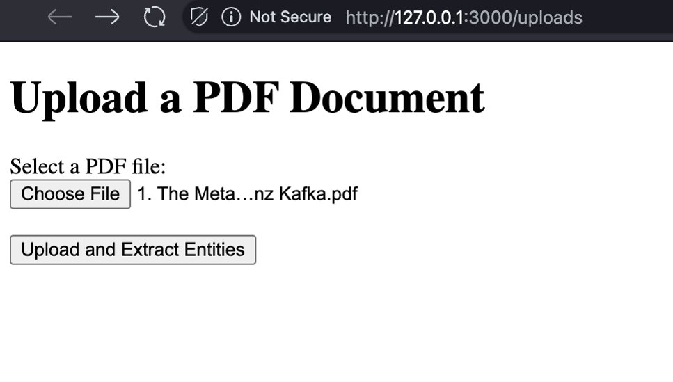
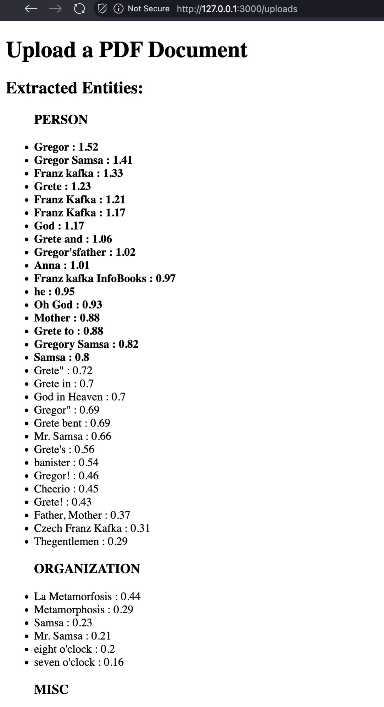

# PDF Entity Extractor

## Table of Contents
1. [Overview](#overview)
2. [Features](#features)
3. [Prerequisites](#prerequisites)
4. [Installation](#installation)
5. [Usage](#usage)
6. [How It Works](#how-it-works)
7. [Configuration](#configuration)
8. [Contributing](#contributing)
9. [License](#license)

---

## Overview

The **PDF Entity Extractor** is a Ruby on Rails web application designed to extract named entities (e.g., people, organizations, locations) from uploaded PDF documents. The application leverages the **MITIE-Ruby** library, which provides robust Named Entity Recognition (NER) capabilities using 100% Ruby code, eliminating the need for external Python dependencies.

This tool is ideal for scenarios where you need to process text data from PDFs and identify key entities without relying on external systems or languages.

---

## Features

- **PDF Upload**: Users can upload PDF files directly through a web interface.
- **Text Extraction**: Automatically extracts text content from the uploaded PDF.
- **Named Entity Recognition (NER)**: Identifies and categorizes entities such as people, organizations, locations, and more using MITIE-Ruby.
- **Web-Based Interface**: Simple and intuitive user interface for uploading files and viewing extracted entities.
- **Pure Ruby Implementation**: No external dependencies like Python or Java, ensuring a lightweight and maintainable solution.

---

## Screenshots
The main page of the application allows users to upload a PDF file for entity extraction.
You can select the PDF document and then press "Upload and Extract Entities" to start the process.


The result is the list of the entities found in the PDF document, grouped by the entity type and sorted by the identification score.



--

## Prerequisites

Before running the application, ensure you have the following installed on your system:

- **Ruby**: Version 3.x or higher.
- **Rails**: Version 8.x or higher.
- **Bundler**: For managing gem dependencies.
- **Database**: SQLite (default) or another supported database (e.g., PostgreSQL, MySQL).
- **MITIE-Ruby Library**: Ensure the `mitie-ruby` gem is available in your Gemfile.

---

## Installation

Follow these steps to set up the application locally:

1. **Clone the Repository**:
   ```bash
   git clone https://github.com/your-repo-url/pdf-entity-extractor.git
   cd pdf-entity-extractor
   ```

2. **Install Dependencies**:
   Install all required gems using Bundler:
   ```bash
   bundle install
   ```
   
3. **Install the MITIE models**:
   Download the MITIE models from following the [configuration section](#download-the-ner-models).


4. **Start the Server**:
   Start the Rails development server:
   ```bash
   rails server
   ```

5. **Access the Application**:
   Open your browser and navigate to `http://localhost:3000`.

---

## Usage

1. **Upload a PDF File**:
    - Go to the home page of the application.
    - Use the file upload form to select a PDF document.
    - Click the "Upload and Extract Entities" button.

2. **View Extracted Entities**:
    - After processing, the application will display a list of identified entities along with their categories (e.g., person, organization, location).
    - Each of the entities has an asociated score, the scores above 0.8 are highlighted to indicate a better detection.

3. **Supported Formats**:
    - The application supports standard PDF files. If the PDF contains images or scanned text, OCR may be required for text extraction (not implemented yet).

---

## How It Works

1. **PDF Text Extraction**:
    - The `pdf-reader` gem is used to extract plain text from the uploaded PDF file.

2. **Named Entity Recognition**:
    - The extracted text is passed to the MITIE-Ruby library, which performs Named Entity Recognition (NER) using pre-trained models.

3. **Entity Display**:
    - The identified entities are categorized and displayed in the web interface.

---

## Configuration

### Environment Variables
The application does not require any specific environment variables by default.

### Download the NER Models
The Mitie library requires the pre-trained models to perform Named Entity Recognition. The default model is included in the `vendor/mitie` directory.
Models can be downloaded from the [MITIE Releases](https://github.com/mit-nlp/MITIE/releases/download/v0.4/MITIE-models-v0.2.tar.bz2) page.

You have to get the `.dat` file, for example `english_ner_model.dat` and paste inside the in `vendor/mitie`. Update the path to the model in `config/mitie.yml` or configuration.

---

## Improvements - TODO

Change the NER library from the MITIE-Ruby to a more modern and maintained library like spaCy or Hugging Face Transformers.

---

## Contributing

Contributions are welcome! If you'd like to contribute to this project, please follow these steps:

1. Fork the repository.
2. Create a new branch for your feature or bug fix:
   ```bash
   git checkout -b my-new-feature
   ```
3. Commit your changes and push the branch to your fork:
   ```bash
   git push origin my-new-feature
   ```
4. Submit a pull request detailing your changes.

---

## License

This project is licensed under the [MIT License](LICENSE). You are free to use, modify, and distribute the code as per the terms of the license.

---

## Acknowledgments

- **MITIE-Ruby**: A pure Ruby implementation of MITIE for Named Entity Recognition.
- **pdf-reader**: A Ruby gem for extracting text from PDF files.
- **Ruby on Rails**: The framework powering this application.